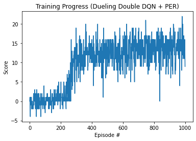

# Navigation Project (Banana Collector)  
Deep Reinforcement Learning Nanodegree - Project 1

## Project Details

In this project, an agent is trained to navigate (and collect bananas) in a large, square world.

- **State space**: 37-dimensional vector  
  Each state contains the agent's velocity, along with ray-based perception of objects around the agent’s forward direction (e.g., wall, yellow banana, blue banana).

- **Action space**: 4 discrete actions  
  0 - move forward  
  1 - move backward  
  2 - turn left  
  3 - turn right

- **Reward structure**:
  - +1 for collecting a yellow banana  
  - -1 for collecting a blue banana  

- **Environment solved when**:  
  The agent achieves an **average score of +13** over 100 consecutive episodes.

---

## Learning Algorithm

The agent was trained using a **Dueling Double Deep Q-Network (DQN)** with **Prioritized Experience Replay (PER)** and **N-step returns**.  
This combination stabilizes learning and improves sample efficiency.

### Key Techniques
- **Dueling Network Architecture**: Separates value and advantage streams to improve value estimation stability.  
- **Double DQN**: Reduces overestimation bias in Q-values.  
- **Prioritized Experience Replay**: Samples important experiences more frequently.  
- **N-step Returns**: Propagates rewards faster for better credit assignment.

### Hyperparameters
| Parameter | Value |
|------------|--------|
| Learning rate (`LR`) | 1e-4 |
| Batch size | 64 |
| Discount factor (`γ`) | 0.99 |
| Soft update parameter (`τ`) | 5e-3 |
| Replay buffer size | 1e5 |
| Update frequency | Every 4 steps |
| N-step size | 3 |
| Epsilon start | 1.0 |
| Epsilon end | 0.01 |
| Epsilon decay | 0.995 |
| Target network update | Soft update |

The best model achieved an **average score of 13+**, successfully solving the environment.

---

## Getting Started

### 1. Dependencies
You’ll need the following installed:

- Python 3.6+
- PyTorch
- NumPy
- Matplotlib
- Unity ML-Agents environment (`unityagents`)

### 2. Download the Environment

You can download the Banana environment for your OS from the Udacity link:
https://github.com/udacity/deep-reinforcement-learning#dependencies

## 🏁 Results

The final agent achieved an average score of 13+ over 100 consecutive episodes using:

Dueling Double DQN

Prioritized Replay Buffer

N-Step Returns
This surpasses the required threshold for solving the environment.

Below is the training performance of the agent during training:

## Author

Developed by Mustafa Caner Sezer
Based on the Udacity Deep Reinforcement Learning Nanodegree framework.